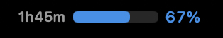
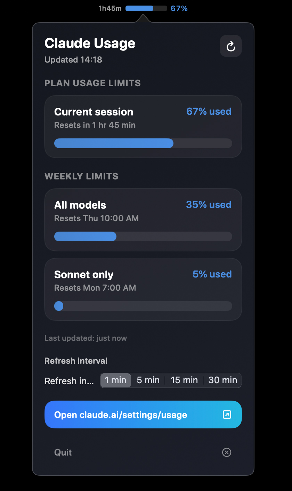

# Claude Usage Monitor

A macOS menu bar app + Chrome extension that shows your Claude.ai usage at a glance.

  

## Screenshots

<p align="center">
  
  <br>
  <em>Usage bar + percentage + reset countdown in the menu bar</em>
</p>

<p align="center">
  
  <br>
  <em>Click to see full usage breakdown</em>
</p>

## What it does

- Shows a **progress bar + percentage** in your macOS menu bar (e.g. `2h40m ████░░ 65%`)
- Click to see a **popover** with all usage details: Current session, All models, Sonnet only — with animated bars, reset countdowns, and color-coded levels
- Chrome extension scrapes `claude.ai/settings/usage` every minute and pushes data to the menu bar app via `localhost`
- Color shifts: blue (< 70%), yellow (70-90%), red (90%+) with pulse animation at high usage

## How it works

```
Chrome Extension (background.js)
  └─ Finds/opens claude.ai/settings/usage tab
  └─ Scrapes usage % via chrome.scripting.executeScript
  └─ POSTs JSON to http://127.0.0.1:4480/usage
       └─ Swift menu bar app receives it
       └─ Updates menu bar + writes cache file
       └─ Timer re-reads cache on interval
```

## Requirements

- macOS 13+ (Ventura or later)
- Swift 6+ toolchain (included with Xcode 16+)
- Google Chrome

## Setup

### 1. Build the menu bar app

```bash
cd ClaudeUsageApp
swift build -c release
```

### 2. Install to Applications (optional)

```bash
APP="/Applications/Claude Usage Monitor.app"
mkdir -p "$APP/Contents/MacOS" "$APP/Contents/Resources"
cp .build/release/ClaudeUsageApp "$APP/Contents/MacOS/Claude Usage Monitor"
cp Info.plist "$APP/Contents/Info.plist"  # see below
```

<details>
<summary>Info.plist</summary>

```xml
<?xml version="1.0" encoding="UTF-8"?>
<!DOCTYPE plist PUBLIC "-//Apple//DTD PLIST 1.0//EN" "http://www.apple.com/DTDs/PropertyList-1.0.dtd">
<plist version="1.0">
<dict>
    <key>CFBundleName</key>
    <string>Claude Usage Monitor</string>
    <key>CFBundleIdentifier</key>
    <string>com.claudeusage.menubar</string>
    <key>CFBundleVersion</key>
    <string>1.0.0</string>
    <key>CFBundleShortVersionString</key>
    <string>1.0.0</string>
    <key>CFBundleExecutable</key>
    <string>Claude Usage Monitor</string>
    <key>CFBundlePackageType</key>
    <string>APPL</string>
    <key>LSMinimumSystemVersion</key>
    <string>13.0</string>
    <key>LSUIElement</key>
    <true/>
    <key>NSHighResolutionCapable</key>
    <true/>
</dict>
</plist>
```
</details>

### 3. Load the Chrome extension

1. Open `chrome://extensions`
2. Enable **Developer Mode**
3. Click **Load unpacked** → select the `extension/` folder
4. Keep a `claude.ai/settings/usage` tab open (the extension will open one automatically if needed)

### 4. Launch

```bash
open "/Applications/Claude Usage Monitor.app"
# or just run directly:
.build/release/ClaudeUsageApp
```

The menu bar app listens on `127.0.0.1:4480` (localhost only). The extension scrapes and posts every minute.

## Menu bar popover

Click the menu bar item to see:
- **Plan usage limits** — Current session with progress bar and reset countdown
- **Weekly limits** — All models, Sonnet only (and any other model tiers)
- Refresh interval picker (1 / 5 / 15 / 30 min)
- Open usage page button
- Quit button

## Architecture

| Component | Tech | Role |
|-----------|------|------|
| `ClaudeUsageApp/` | Swift + SwiftUI + AppKit | Menu bar app with NSPopover |
| `extension/` | Chrome MV3 | Scrapes usage page, POSTs to localhost |
| `localhost:4480` | NWListener (built into app) | Receives usage JSON from extension |

## Security

- HTTP server binds to **127.0.0.1 only** — not accessible from LAN
- JSON is validated (must decode as `UsageSnapshot`) before writing to cache
- Cache file written with `0600` permissions (owner-only)
- No credentials stored — extension uses your existing Chrome session
- No data leaves your machine

## File structure

```
claude-usage-monitor/
├── ClaudeUsageApp/
│   ├── Package.swift
│   └── Sources/
│       ├── AppDelegate.swift
│       ├── ClaudeUsageApp.swift
│       ├── StatusItemController.swift
│       ├── UsageModels.swift
│       ├── UsageStore.swift
│       └── Views.swift
├── extension/
│   ├── manifest.json
│   ├── background.js
│   ├── content.js
│   └── icons/
└── README.md
```

## License

MIT
